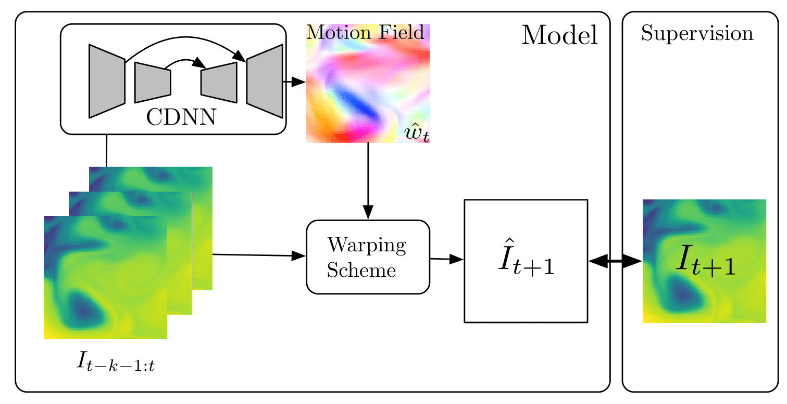

# *Deep Learning for Physical Processes: Integrating Prior Scientific Knowledge:* Pytorch Implementation



## To get going:
Clone repository with submodules: ``` git clone --recursive https://github.com/emited/flow```

## Dataset
Download the data [here](http://marine.copernicus.eu/services-portfolio/access-to-products/?option=com_csw&view=details&product_id=GLOBAL_ANALYSIS_FORECAST_PHY_001_024).

## Results


**Note**: This implementation currently uses bilinear interpolation for warping. The gaussian warping scheme will be integrated shortly into pytorch. Take a look at the pull request [here](https://github.com/pytorch/pytorch/pull/5487) for a status update.
