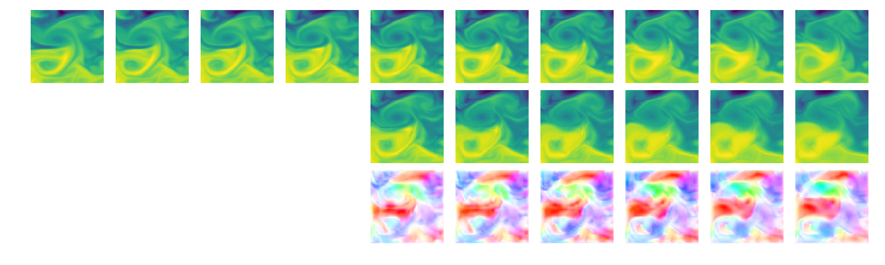

# *Deep Learning for Physical Processes: Integrating Prior Scientific Knowledge:*

Official Pytorch implementation of ICLR 2018 paper [Deep Learning for Physical Processes: Integrating Prior Scientific Knowledge](https://openreview.net/pdf?id=By4HsfWAZ).


## Guetting started:
Clone repository along with submodules: ``` git clone --recursive https://github.com/emited/flow```

## Dataset
Download the data [here](http://marine.copernicus.eu/services-portfolio/access-to-products/?option=com_csw&view=details&product_id=GLOBAL_ANALYSIS_FORECAST_PHY_001_024).

## Results


**Note**: By defalt, this implementation currently uses bilinear interpolation for warping. This scheme works well for modeling purely advective processes. For advective and diffusive processes, a gaussian warping scheme can be used (flow/modules/warps/GaussianWarpingScheme). The gaussian warping scheme will be integrated shortly into pytorch. Take a look at the pull request [here](https://github.com/pytorch/pytorch/pull/5487) for a status update. While waiting, it is possible to build pytorch from a forked version available [here](https://github.com/pajotarthur/pytorch).
